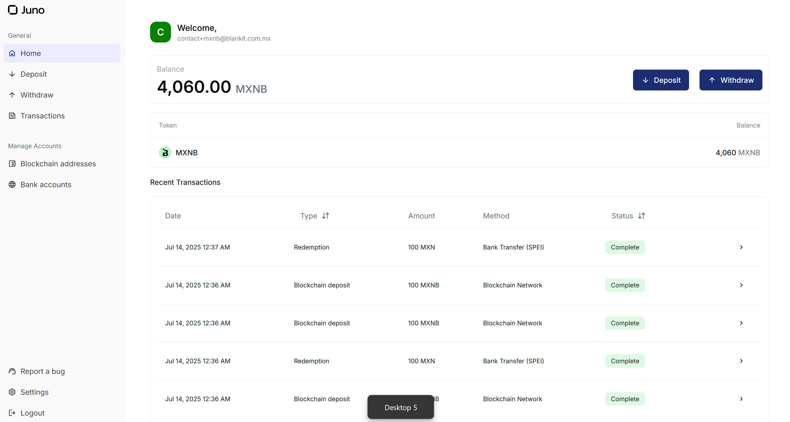
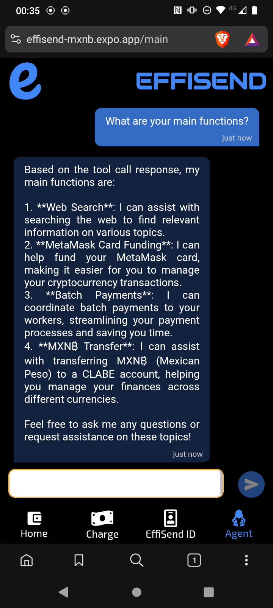

<hr/>
<p align="center">
  
</p>

EffiSend is a decentralized identity platform powered by MXNB. It combines FaceID biometrics and an AI agent for secure, seamless identity management. Integrated with Juno, it enables SPEI on/off ramps and rewards users for verified interactions and ecosystem participation—bridging trust, finance, and incentives in one experience

## ⚡Fast Links:

APP CODE: [CODE](./effisend-mxnb/)

WEB DAPP: [LINK](https://effisend-mxnb.expo.app/)

VIDEODEMO: [LINK](pending...)

<hr>

## 🚀 System Diagram

EffiSend is built entirely from scratch to leverage the most advanced web3 infrastructure.


- [**Juno**](https://juno.finance/)
  Provides secure, reliable, and user-friendly on/off ramps for users to buy MXNB tokens directly from the app. Juno is also used to send users' MXNB tokens to their respective wallets after rewards distribution.

- [**MXNB**](https://mxnb.finance/)
  The main token used to interact with Juno services and track user rewards. MXNB is a fast, secure, and decentralized token with a low environmental impact.

- [**Arbitrum**](https://arbitrum.io/)
  Serves as the main blockchain powering EffiSend transactions and rewards distribution. This Ethereum Layer 2 offers high throughput and low fees, making it ideal for scalable token transfers and automated smart contract operations tied to MXNB.

- [**Lanchain (AI Agent)**](https://lanchain.com/)
  This framework enables us to create our agent system and its interaction with the user through DeSmond. It allows EffiSend to facilitate MXNB transfers as MXN via SPEI, send money in batches to employees, and finally, perform an off-ramp to our MetaMask card.

- [**DeepFace**](https://viso.ai/computer-vision/deepface/)
  DeepFace is used to enhance facial recognition capabilities with real-time verification and anti-spoofing features. By cross-validating identity against secure embeddings, it boosts biometric reliability, ensuring that wallet access and reward claiming remain both frictionless and secure.

## 📈 Juno Integration:

EffiSend utilizes Juno for seamless integration with traditional banking systems, enabling functionalities such as CLABE creation, bank account registration, and SPEI transfers.



### Custom NodeJS Module:

To integrate Juno seamlessly into our services, we first created a custom NodeJS module that abstracts away the complexity of the Juno API. This allows us to interact with the Juno API using a simple, intuitive interface, without having to heavily modify our code.

<hr>

### Sign Request:

Juno, as a secure platform, requires a request signature to be generated before making the request. Thus, we first created a code that automatically generates this signature in NodeJS.

```javascript
function signRequest(request) {
    const nonce = Date.now().toString();
    const method = request.method; 
    const path = request.path;
    const body = request.body || ""; 
    const data = `${nonce}${method}${path}${body}`;
    const hmac = crypto.createHmac("sha256", apiSecret);
    hmac.update(data);
    const signature = hmac.digest("hex");
    return `Bitso ${apiKey}:${nonce}:${signature}`;
}
```

After implementing this module, we could make any API call to Juno through our code in the following way.

```javascript
async function getClabes() {
    const requestOptions = {
        method: "GET",
        redirect: "follow",
        path: "/mint_platform/v1/accounts/banks",
    };
    const myHeaders = new Headers();
    myHeaders.append("Content-Type", "application/json");
    myHeaders.append("Authorization", signRequest(requestOptions));
    requestOptions.headers = myHeaders;

    return new Promise((resolve) => {
        fetch(
            `https://stage.buildwithjuno.com${requestOptions.path}`,
            requestOptions
        )
            .then((response) => response.json())
            .then((result) => resolve(result))
            .catch(() => resolve(null));
    });
}
```

All technical implementations for this module are included here.

- [Juno Functions](./Cloud%20Functions/junoFunctions.js)
- [Juno Docs Reference](https://docs.bitso.com/juno/docs/create-signed-requests)

<hr>

### Create or Recover Account:

As a platform based on identity, users can create or recover their accounts simply by taking a selfie. This process, although complex on the inside, provides a better experience for the user. The integration of Juno in this process is to configure all user credentials in order to perform one of the traditional and crypto services.

   

- Create User Main Code.

```javascript
// Create User Wallet
const wallet = Wallet.createRandom();
const address = wallet.address;
// Create a Mock Clabe "third party" for the user
const myClabe = clabe.calculate(002, 180, generateRandomNumber()); 
// Create a Clabe for the user to receive MXNB with Juno (Multiple User CLABEs feature)
const tempRClabe = await createClabe();
// Add Clabe and Blockchain account to JUNO
await addBlockchain({
    tag: user,
    network: "ARBITRUM",
    address
})
await addBankAccount({
    tag: user,
    recipient_legal_name: random_name(),
    clabe: myClabe,
    ownership: "THIRD_PARTY",
})
const rclabe = tempRClabe.payload.clabe; 
// Create a dataframe of the user, all this data is part of the "user" entity on the backend.
let dataframe = {
    privateKey: wallet.privateKey,
    address,
    user,
    clabe: myClabe,
    rclabe,
}
await Accounts.doc(user).set(dataframe);
// Setup 20 MXNB to the user as a reward to create a new wallet. This is contract based 
await contract.allocateReward(address);
res.send({
    error: null,
    result: {
        address,
        user,
        clabe: myClabe,
        rclabe
    }
});
```

Although it may seem a bit complex, with this single code we can configure everything necessary for the user to fully utilize the platform.

NOTE: The only part that is done via Mockup is the Clabe of the third party bank, to simulate transfers from Juno to the bank, as we cannot issue them in a real way.

All technical implementations for this module are included here.

- [Juno Functions](./Cloud%20Functions/junoFunctions.js)
- [Create or Recover](./Cloud%20Functions/create-or-fetch-user.js)
- [Juno Docs Reference](https://docs.bitso.com/juno/docs/create-clabes)

<hr>

### SPEI and MXNB Transfers:

We can transfer of funds from the EffiSend system to external bank accounts via SPEI and also handles the transfer of MXNB tokens to a designated Juno address on the blockchain.

   

- Create User Main Code.

```javascript
// Fetch if the user Exist on the platform
let query = await Accounts.where("user", "==", req.body.user).get();
if (query.empty) {
    throw "BAD USER"
}
// Get all the third party CLABES registered on Juno
const { payload } = await getClabes();
const clientObject = payload.find((x) => req.body.clabe === x.clabe);
if (!clientObject) {
    throw "BAD CLABE"
}
// Extract the ID of the Clabe to use the Juno API and Transfer XXX Amount of MXNB to CLABE via SPEI (this is a mock tranfer)
const { id } = clientObject;
await speiToBank({
    amount: parseInt(req.body.amount),
    destination_bank_account_id: id,
    asset: "mxn",
})
// Send the same amount of the Client MXNB on Abritrum to the platform wallet. (this is real blockchain transfer on testnet)
const { privateKey } = query.docs[0].data();
const wallet = new Wallet(privateKey, provider);
const contract = new Contract("0x82B9e52b26A2954E113F94Ff26647754d5a4247D", ERC20abi, wallet)
const transaction = await contract.transfer(junoAddress, parseUnits(req.body.amount, 6))
await transaction.wait();
```
This process is relatively straightforward. Thanks to Juno, we can coordinate the transfer of MXNB from the user's account to their bank account, while simultaneously sending the same amount of MXNB from the user's wallet to Juno's account on the blockchain. This ensures that the "books" are balanced, with the user receiving the transferred funds and Juno's account being updated accordingly.

All technical implementations for this module are included here.

- [Juno Functions](./Cloud%20Functions/junoFunctions.js)
- [Spei Transfer](./Cloud%20Functions/send-mxnb-to-spei.js)
- [Juno Docs Reference](https://docs.bitso.com/juno/docs/create-mock-deposits)

## 💲MXNB:
A key component of our application is the utilization of MXNB as the primary token, largely due to its seamless integration with the Juno Platform, which enables us to effortlessly execute on-ramp and off-ramp transactions. Furthermore, we employ MXNB as the primary token for payments and as rewards for users.

### Payments:
For the use case of payments, MXNB offers a convenient way to make blockchain-based payments in Mexican pesos, as it is an ERC20 token and performing operations with this type of tokens is relatively straightforward.

   

- Create User Main Code.

```javascript
// Fetch user based on the identifier.
let query = await Accounts.where("user", "==", req.body.user).get();
if (query.empty) {
  throw "BAD USER";
}
// Get the user private key and make the payment
const { privateKey } = query.docs[0].data();
const wallet = new Wallet(privateKey, provider);
let transaction;
if (req.body.token === 0) {
  // Native token transfer
  transaction = {
    to: req.body.destination,
    value: parseEther(req.body.amount),
  };
} else {
  // ERC20 token transfer
  const interface = new Interface(abiERC20);
  const data = interface.encodeFunctionData("transfer", [
    req.body.destination,
    parseUnits(req.body.amount, tokens[req.body.token].decimals),
  ]);
  transaction = {
    to: tokens[req.body.token].address,
    data,
  };
}
// Send the transaction.
const result = await wallet.sendTransaction(transaction);
res.send({
  error: null,
  result: result.hash,
});
```
Making a payment with an ERC20 token is straightforward. This interface enables us to facilitate all the payments requested by the user. In the case of EffiSend, these payments are executed after a successful facial recognition or by scanning a QR code (like Alipay). The details of these processes will be outlined later.

All technical implementations for this module are included here.

- [Execute Payment](./Cloud%20Functions/execute-payment.js)

<hr>

### Rewards:

As a platform built on identity, we follow the rewards model of Worldcoin, which rewards users for utilizing the platform and signing up. So, every time a user completes a certain number of transactions or actions, they receive a reward in MXNB tokens.

   

- The first reward for creating an account, this code has already been explained previously [HERE](#create-or-recover-account), however, we'll review the process and how it's coordinated with our smart contract.

```javascript
// List of testnet public rpcs
const rpcs = [
    "https://arbitrum-sepolia-rpc.publicnode.com",
    "https://sepolia-rollup.arbitrum.io/rpc",
    "https://arbitrum-sepolia.public.blastapi.io",
    "https://arbitrum-sepolia.drpc.org/",
]
// Dynamic provider to avoid problems on rpcs
const provider = new DynamicProvider(rpcs, {
    strategy: new FallbackStrategy(),
});
// Owner of the contract
const wallet = new Wallet("0xPrivateKey", provider);
// Rewards Contract
const contract = new Contract("0x04A4e03a1F879DE1F03D3bBBccd9CB9500d6A7e8", abi, wallet)
...
// Allocate 20 MXNB (Default by contract)
await contract.allocateReward(address);
```

- On the smart contract side, which already has the rewards in its balance, it can distribute and keep a count of the rewards distributed to each user, which in turn helps us generate a Trust Score algorithm, to improve recommendations in the future.

```javascript
// DEFAULT_REWARD = 20000000 MXNB tokens (20 MXN)
function allocateReward(address _recipient) external onlyOwner {
    require(_recipient != address(0), "Invalid recipient address");

    if (allocatedRewards[_recipient] == 0) {
        rewardAddresses.push(_recipient);
    }

    allocatedRewards[_recipient] = DEFAULT_REWARD;
    emit RewardAllocated(_recipient, DEFAULT_REWARD);
}
```

All technical implementations for this module are included here.

- [Create or Recover](./Cloud%20Functions/create-or-fetch-user.js)
- [Rewards Contract](./Contracts/rewards.sol)

## 🌐 Arbitrum:

As seen in the provided code snippets, Arbitrum plays a direct role in EffiSend's core functionalities:

- MXNB Token Transfers: When MXNB tokens are transferred between user wallets and Juno's account (e.g., during SPEI transfers or direct payments), these are real blockchain transactions executed on the Arbitrum Sepolia testnet. This demonstrates Arbitrum's role as the underlying blockchain for crypto-to-fiat synchronization.

- Batch Balances: To enhance the user experience, the batch balances feature was implemented to fetch all token balances in a single contract call. This allows the frontend to display the user's balances more efficiently.
  - Contract Address on Testnet: [0xcf4902BC621E97B8d574f1E91c342f0c44C8baE5](https://sepolia.arbiscan.io/address/0xcf4902BC621E97B8d574f1E91c342f0c44C8baE5)
  - Contract Code: [Batch Balances](./Contracts/batchbalances.sol)

  ```javascript
  // Get the allocated reward for a specific user
  function getAllocatedReward(
      address _recipient
  ) external view returns (uint256) {
      return allocatedRewards[_recipient];
  }
  // Get the claim count for a specific user
  function getClaimCount(address _recipient) external view returns (uint256) {
      return claimCounts[_recipient];
  }
  ```

- Rewards Smart Contract Deployment: The MXNBRewardsDistributor smart contract is deployed on Arbitrum. This allows EffiSend to efficiently allocate and distribute MXNB rewards to users with low gas costs and quick confirmations, fostering a robust reward ecosystem.
  - Contract Address on Testnet: [0x04A4e03a1F879DE1F03D3bBBccd9CB9500d6A7e8](https://sepolia.arbiscan.io/address/0x04A4e03a1F879DE1F03D3bBBccd9CB9500d6A7e8)
  - Contract Code: [MXNBRewardsDistributor](./Contracts/rewards.sol)

  ```javascript
  function batchBalanceOf(address _owner, address[] memory _tokenAddresses)
      public
      view
      returns (uint256[] memory)
  {
      // Initialize an array to store balances for each token
      uint256[] memory balances = new uint256[](_tokenAddresses.length);

      // Loop through each token address and fetch the balance for _owner
      for (uint256 i = 0; i < _tokenAddresses.length; i++) {
          balances[i] = ERC20(_tokenAddresses[i]).balanceOf(_owner);
      }

      // Return the array of balances
      return balances;
  }
  ```

All technical implementations for this module are included here.

- [Batch Balances](./Contracts/batchbalances.sol)
- [MXNBRewardsDistributor](./Contracts/rewards.sol)

## FaceID Payment

EffiSend enables seamless payments via facial recognition by linking a user’s unique biometric profile to their wallet and Juno Account.

   

- The primary function is to create a new user or locate an existing one. This process is dedicated solely to validation, ensuring that the system remains secure and isolated from other services.

  ```python
  @app.post("/fetchOrSave", dependencies=[Depends(check_api_key)])
  async def findUser(item: ItemUserFace):
  # Define a function to handle image processing and facial recognition
  def process_image(image_data):
      # Save image to temporary file
      temp_file = TEMP_DIR / f"{os.urandom(32).hex()}.jpg"
      with open(temp_file, "wb") as f:
          f.write(base64.b64decode(image_data))
      
      # Perform facial recognition
      try:
          result = DeepFace.find(img_path=temp_file, db_path=DB_DIR, anti_spoofing=True)
          return result[0].identity[0].split('.')[0].split('/')[2]
      except Exception as e:
          return False
      finally:
          # Remove temporary file
          temp_file.unlink()

  # Define a function to handle database operations
  def save_image(image_data, nonce):
      image = Image.open(BytesIO(base64.b64decode(image_data)))
      image.save(DB_DIR / f"{nonce}.jpg")
      return True

  # Process image and facial recognition
  result = process_image(item.image)
  if result:
      return {"result": result}
  else:
      # Save image to database
      save_image(item.image, item.nonce)
      return {"result": True}
  ```

- The second function exclusively conducts a user search through facial recognition, retrieving only the user data.

  ```python
  @app.post("/fetch", dependencies=[Depends(check_api_key)])
  async def findUser(item: ItemFind):
    # Define a function to handle image processing and facial recognition
    def process_image(image_data):
        # Save image to temporary file
        temp_file = TEMP_DIR / f"{os.urandom(32).hex()}.jpg"
        with open(temp_file, "wb") as f:
            f.write(base64.b64decode(image_data))
        
        # Perform facial recognition
        try:
            result = DeepFace.find(img_path=temp_file, db_path=DB_DIR, anti_spoofing=True)
            return result[0].identity[0].split('.')[0].split('/')[2]
        except Exception as e:
            return False
        finally:
            # Remove temporary file
            temp_file.unlink()

    # Process image and facial recognition
    result = process_image(item.image)
    print(result)
    if result:
        return {"result": result}
    else:
        return {"result": False}
  ```

All technical implementations for this module are included here.

- [Face Recognition Server](./FaceID%20Server/main.py)

<hr>

## 🤖 AI Agent (DeSmond):

The EffiSend platform incorporates an AI agent named DeSmond, built using the Langchain framework. DeSmond is capable of understanding and responding to natural language inputs, allowing users to interact with the platform in a more conversational and intuitive way. DeSmond can perform various tasks, such as web searches, SPEI transfers, and Metamask top-ups from MXNB.

  

### Agent Setup and Tools

DeSmond utilizes several specialized tools to handle different user requests. These tools are integrated into a graph-based workflow, allowing for conditional execution based on the user's intent.

**Available Tools:**

- **`web_search`**: Performs accurate and targeted internet searches for specific terms or phrases. It activates when the user explicitly requests a web search or seeks real-time information.

  ```javascript
  const webSearch = tool(
    async ({ query }) => {
      console.log("Web Search Tool invoked with query:", query);
      const res = await webSearchTool.invoke(query); 
      return JSON.stringify({ status: "success", query, results: res });
    },
    {
      name: "web_search",
      description:
        "This tool allows users to perform accurate and targeted internet searches for specific terms or phrases. It activates whenever the user explicitly requests a web search, seeks real-time or updated information, or mentions terms like 'search,' 'latest,' or 'current' related to the desired topic.",
      schema: z.object({
        query: z.string(),
      }),
    }
  );
  ```

- **`transfer_to_spei`**: Facilitates MXNB Coin (MXNB) transfers on Arbitrum Sepolia to a SPEI CLABE account. It activates when the user requests to send MXNB to a CLABE.

  ```javascript
  const transferToSpei = tool(
    async ({ amount, clabe }, { configurable: { user } }) => {
      const response = await executeTranferToSpei({ amount, clabe, user });
      return JSON.stringify({
        status: "success",
        message: "Your balance is now available on your CLABE.",
        transaction: response,
      });
    },
    {
      name: "transfer_to_spei",
      description:
        "This tool facilitates MXNB Coin (MXNB) transfers on the Arbitrum Sepolia to a Spei CLABE account. It activates when the user explicitly requests to send MXNB to a CLABE or mentions relevant terms such as 'transfer,' 'MXNB,' 'Arbitrum Sepolia,' or 'Spei CLABE' in the context of wallet activity.",
      schema: z.object({
        amount: z.string(),
        clabe: z.string(),
      }),
    }
  );
  ```

- **`transfer_to_multiple_spei`**: Enables automated MXNB Coin (MXNB) transfers from Arbitrum Sepolia to multiple SPEI CLABE accounts via a backend API. This is designed for batch payment operations.

  ```javascript
  const transferToSPEImultiple = tool(
    async ({ amount }, { configurable: { user } }) => { 
      // Mock CLABEs for POC
      const clabes = [
        "002180561501567250",
        "002180519974240622",
        "002180245215700836",
      ];
      const response = await executePayments(clabes, amount, user);
      return JSON.stringify({
        status: "success",
        message: "All the CLABES received the payment. Correctly.",
      });
    },
    {
      name: "transfer_to_multiple_spei",
      description:
        "This tool enables automated MXNB Coin (MXNB) transfers from the Arbitrum Sepolia testnet to multiple SPEI CLABE accounts via a backend API. Designed for batch payment operations to the employees of this client, it ensures parallel execution, response validation, and detailed transaction reporting. It activates whenever users request to transfer MXNB to several CLABEs or reference actions involving 'MXNB','Arbitrum Sepolia', 'SPEI CLABE,' or other relevant wallet activity keywords.",
      schema: z.object({
        amount: z.string(),
      }),
    }
  );
  ```

- **`list_of_tools`**: Provides a list of available tools for the user to interact with.

  ```javascript
  const listOfTools = tool(
    () => {
      console.log("List of Tools Tool invoked.");
      return JSON.stringify({
        status: "info",
        message:
          "DeSmond can search the web, help you fund your MetaMask card, coordinate batch payments to your workers, and transfer your MXN₿ to a CLABE account.",
      });
    },
    {
      name: "list_of_tools",
      description:
        "This tool provides a list of available tools for the user to interact with. It activates whenever the user explicitly requests information about available tools or commands.",
      schema: z.object({}),
    }
  );
  ```

- **`fallback`**: Activates when no other tool is directly invoked, prompting a friendly invitation for user interaction.

  ```javascript
  const fallbackTool = tool(
    () => {
      console.log("Fallback Tool invoked.");
      return JSON.stringify({
        status: "info",
        message:
          "As stated above, say something friendly and invite the user to interact with you.",
      });
    },
    {
      name: "fallback",
      description:
        "This tool activates only when the assistant has no other tool actively invoked in response to a user query",
      schema: z.object({}),
    }
  );
  ```

All technical implementations for this module are included here.

- [AI Agent](./Agent%20Server/app/main.py)

### Special Menthod (ONLY IN MAINNET):

In the case of the MetaMask Card fund, it is activated when the user requests to send MXN to a MetaMask card using an address. However, unlike all other methods, this one works entirely on the Arbitrum Mainnet. It's worth noting that an active MetaMask card is required to use it, just like in the demo video.


- **`fund_metamask_card`**: Facilitates MXNB Coin (MXNB) transfers on Arbitrum Mainnet to USDC on Linea. It activates when the user opts to send MXNB to a MetaMask Card.

  ```javascript
  const fundMemamaskCard = tool(
    async ({ amount, to }, { configurable: { user } }) => {
      const response = await exexuteTranfer({ amount, to, user });
      return JSON.stringify({
        status: "success",
        message: "Your balance is now available on your Metamask Card.",
        transaction: response,
      });
    },
    {
      name: "fund_metamask_card",
      description:
        "This tool facilitates MXNB Coin (MXNB) transfers on the Arbitrum Mainnet to USDC on Linea. It generates transaction data for the user to sign and activates when the user explicitly opts to send MXNB to a MetaMask Card or mentions relevant terms such as 'transfer,' 'MXNB,' 'Arbitrum Mainnet,' or 'MetaMask Card' in the context of wallet activity.",
      schema: z.object({
        amount: z.string(),
        to: z.string(),
      }),
    }
  );
  ```

- Code to swap and bridge MXNB from Arbitrum Mainnet to USDC Linea.

```javascript
...
///////// Swap MXNB to USDT on Arbitrum /////////
const swapperContract = new Contract(
  swapperAddress,
  SwapRouter.INTERFACE.format(),
  wallet
);
const InputTokenContract = new Contract(
  InputToken.address,
  ERC20abi,
  wallet
);
// Get the pool information
const [token0, token1, fee] = await Promise.all([
  poolContract.token0(), // MXNB
  poolContract.token1(), // USDT
  poolContract.fee(),    // Transaction Fee
]);
// Quote the amount out
const quotedAmountOut =
  await quoterContract.quoteExactInputSingle.staticCall(
    token0,
    token1,
    fee,
    parseUnits(amount, InputToken.decimals).toString(),
    0
  );
// Approve the swap transaction
const approveTransaction = await InputTokenContract.approve(
  swapperAddress,
  parseUnits(amount, InputToken.decimals).toString()
);
await approveTransaction.wait();
// Execute the swap
const swapParameters = {
  tokenIn: InputToken.address,
  tokenOut: OutputToken.address,
  fee,
  recipient: wallet.address,
  deadline: Math.floor(new Date().getTime() / 1000 + 60 * 10),
  amountIn: parseUnits(amount, InputToken.decimals).toString(),
  amountOutMinimum: quotedAmountOut,
  sqrtPriceLimitX96: 0,
};
const swapTransaction = await swapperContract.exactInputSingle(
  swapParameters
);
await swapTransaction.wait();
console.log(swapTransaction.hash);

///////// Bridge USDT on Arbitrum to USDC on LINEA /////////
const quoteRequest = {
  fromChain: ChainId.ARBITRUM_ONE, // Arbitrum
  toChain: LineaToken.chainId, // LINEA
  fromToken: OutputToken.address, // USDT on Arbitrum
  toToken: LineaToken.address, // USDC on Linea
  fromAmount: quotedAmountOut, // Amount of USDC
  fromAddress: wallet.address, // User address
  toAddress: address, // Metamask card address,
};
// Get the quote
const quote = await getQuote(quoteRequest);
// Convert the quote to a route
const route = convertQuoteToRoute(quote);
// Get the transaction
const transaction = route.steps[0].transactionRequest;
const contract = new Contract(quoteRequest.fromToken, ERC20abi, provider);
// Approve the transaction
const transactionApproval = await contract.interface.encodeFunctionData(
  "approve",
  [transaction.to, quoteRequest.fromAmount]
);
// Execute the approval transaction
const resultApproval = await wallet.sendTransaction({
  from: wallet.address,
  to: quoteRequest.fromToken,
  data: transactionApproval,
});
const receiptApproval = await resultApproval.wait();
// Execute the bridge transaction
const resultCCTP = await wallet.sendTransaction(transaction);
const receiptCCTP = await resultCCTP.wait();
...
```
